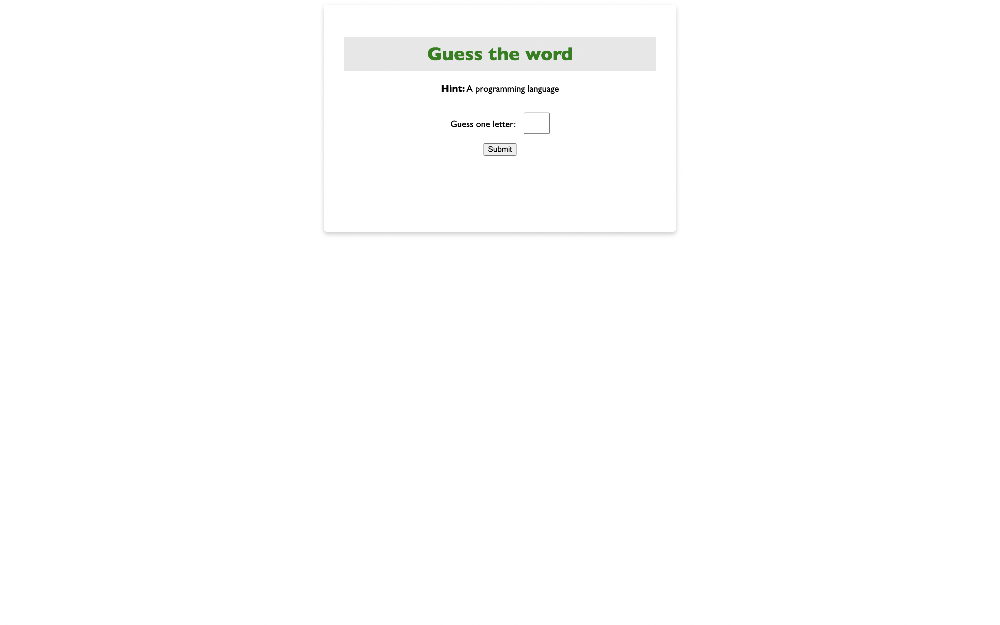

# Word Guessing Game

This simple web-based word guessing game challenges users to guess a word related to programming languages. The game provides a hint and allows players to input one letter at a time to uncover the hidden word.

## Table of Contents

- [Game Preview](#game-preview)
- [Getting Started](#getting-started)
- [How to Play](#how-to-play)
- [Styling](#styling)
- [Hosting with Docker](#hosting-with-docker)

## Game Preview



## Getting Started

To run this game locally, follow these steps:

1. Clone the repository:

   ```bash
   git clone https://github.com/elkingarcia11/word-guessing-game.git
   ```

2. Open the `index.html` file in your web browser.

## How to Play

1. Open the game in your web browser.
2. Read the hint provided (in this case, it's a programming language).
3. Guess one letter at a time by entering it into the input box.
4. Click the "Submit" button to submit your guess.
5. Continue guessing letters until you successfully uncover the entire word.

## Styling

The game features a simple and responsive design with a card layout. The styling is achieved through the `style.css` file, providing an aesthetically pleasing and user-friendly interface.

### Styling Highlights

- **Heading:** The heading is styled with a background color, green text, and increased font size for emphasis.

- **Card Design:** The game content is enclosed within a card, featuring a border, shadow, and rounded corners for a visually appealing layout.

- **Input Box:** The input box for guessing letters is styled with appropriate width, padding, and font size for a seamless user experience.

- **Display Word:** The displayed word is styled with a larger font size, making it easily readable for players.

Feel free to customize the styling according to your preferences by modifying the `style.css` file.


## Hosting with Docker

To host the Word Guessing Game using Docker, follow these steps:
1. Download Docker and start the Docker daemon on your machine

2. Open a terminal and navigate to the directory containing the Dockerfile.

3. Build the Docker image:

   ```bash
   docker build -t word-guessing-game .
   ```

4. Run the Docker container:

   ```bash
   docker run -p 80:80 word-guessing-game
   ```

5. Open your web browser and go to [http://localhost:80](http://localhost:80) to play the Word Guessing Game.

Now, the Word Guessing Game should be running in a Docker container on your local machine. You can customize the port mapping in the `docker run` command if you prefer a different port.

Enjoy playing the Word Guessing Game! If you have any feedback or suggestions, feel free to contribute or open an issue in the repository.